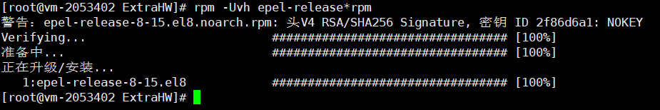
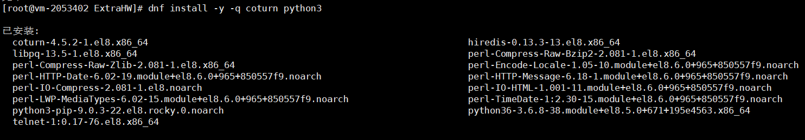
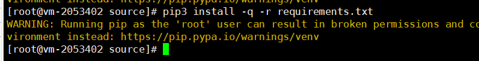
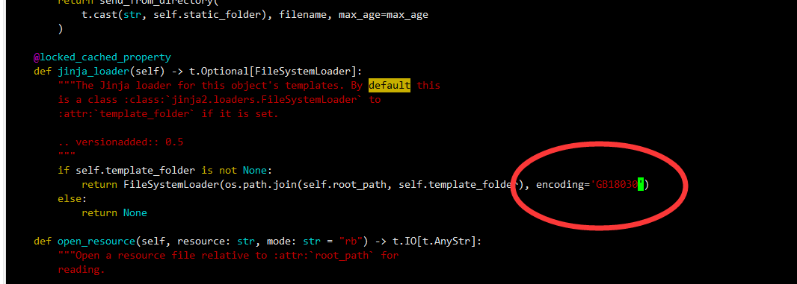

## 安装步骤

[toc]

**(当前目录默认是990101/)**

### 1. 配置epel仓库(coturn需要配置这个仓库)

rpm文件是`990101/source/epel-release-8-15.el8.noarch.rpm`

```shell
rpm -Uvh --force ./source/epel-release*rpm
```



### 2. 安装coturn和python3

```shell
dnf -y -q install python3 coturn 
```



### 3. 使用pip安装需要的包

```shell
pip3 install -q -r ./source/requirements.txt
```



**注**: 此处如果pip版本过低, 可能会出现UnicodeError, 需要先将linux的字符集设置为UTF-8并且升级pip

(现象是pip无法执行任何安装/升级的操作, 在GB18030编码下使用`python3 -m pip install --upgrade pip`也是UnicodeError)

### 4. 覆盖flask的部分源码, 满足网页字符编码GB18030的要求

修改好的scaffold.py已经放在`990101/source/scaffold.py`, 执行的操作是

```shell
 \cp ./source/scaffold.py $(pip3 show flask | grep Location | awk -F "Location: " '{printf "%s/flask/",$2}')
```


要覆盖的文件是flask里的scaffold.py, 如下图, 需要在345行左右的位置添加encoding="GB18030", 否则使用默认编码为UTF-8



``

### 5. 将webrtc的源码部分复制到/usr/bin/webrtc_Tony

源码部分的位置在`990101/source/code`

```shell
mkdir /usr/bin/webrtc_Tony/
\cp -r ./source/code /usr/bin/webrtc_Tony/
```


### 6. 将webrtc和turnserver的config文件复制到/etc

两个config文件都在`99011/config`目录下, 都需要复制到/etc/中

```shell
\cp -r ./config/* /etc
```


### 7. 将用于https和turn服务器的签名文件复制到/etc/webrtc_Tony/

需要pem格式的签名文件公钥和私钥

提供了默认的签名文件`990101/source/cert.crt` 和`990101/source/cert.key`

```shell
mkdir /etc/webrtc_Tony/
\cp ./source/cert.crt ./source/cert.key /etc/webrtc_Tony
```


### 8. 建立错误日志目录

```shell
mkdir /var/log/webrtc_Tony/
```


### 9. 将用于开机自动启动的脚本和服务复制到对应的位置, 设置开机自启

```shell
chmod +x ./source/flask_run.sh
\cp ./source/flask_run.sh /usr/bin/webrtc_Tony/
\cp ./source/flask.service /etc/systemd/system/
systemctl daemon-reload
systemctl start flask.service
systemctl enable flask.service
```


所有需要的文件都已经复制到对应位置

数据库进行了初始化, 数据库的导入在使用手册中介绍

如果需要导入样例数据库信息, 执行`mysql -u root -proot123 < /etc/webrtc_Tony/user.sql` 即可
