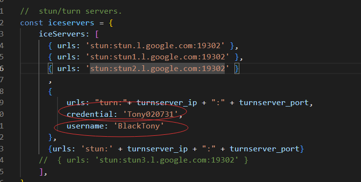
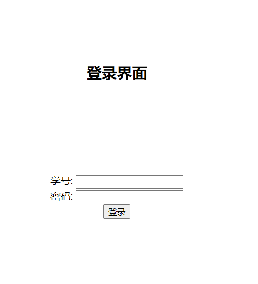

## 使用手册

[toc]

### 运行webrtc服务器的方法

在执行install.sh之后, `systemctl start flask.service`即可

数据库的初始化不需要在未运行服务的状态进行

在` /etc/webrtc_Tony/user.sql`中提供了一个数据库样本

可以使用命令`mysql -u [用户名] -p[密码] < /etc/webrtc_Tony/user.sql`来完成数据库的初始化


### turn服务器的配置文件

在不配置turn服务器的状态下, webrtc的监控端只能监控到同一内网的用户, 无法连接到其他用户

turn服务器的config文件是`/etc/turnserver.conf`

#### 各项配置的解释

需要配置的内容包括如下内容

**必须**配置的内容为`external-ip`: 要输入服务器的外网ip

其他内容**可以**修改的包括

 `min-port`, `max-port` : 用于turn服务器的UDP通信转发

`cert` ,`pkey` :用于turn服务器的证书

如果要修改静态账号, 需要同步修改` /usr/bin/webrtc_Tony/static/js/student.js`和`/usr/bin/webrtc_Tony/static/js/teacher.js`中的内容:



如果要修改`listening-port`, 需要同步修改`/etc/webrtc_Tony.conf`中的对应内容

#### 配置样例

```
# 转发的外网ip(本机外网ip)，用于NAT 地址映射
external-ip=8.130.97.48


#UDP 最小端口和最大端口
min-port=40000
max-port=60000
cli-password=Tony020731
# WebRTC 的消息里会用到
fingerprint

# WebRTC 认证需要
lt-cred-mech

#中继服务器的监听器IP地址
listening-ip=0.0.0.0

#静态账号
user=BlackTony:Tony020731

# 证书
cert=/etc/webrtc_Tony/cert.crt

# 证书key
pkey=/etc/webrtc_Tony/cert.key

#listening-port=3478
```

### webrtc的配置文件

配置文件为`/etc/webrtc_Tony.conf`

#### 各项配置的解释

`root_dir.dir` 录制文件的存放文件夹

`frame.width` 录制理想宽度, 实际录制文件宽度为`min(理想宽度, 设备提供最大宽度)`

`frame.high` 录制理想高度, 实际录制文件宽度为`min(理想高度, 设备提供最大高度)`

`frame.rate` 录制理想每秒帧率, 实际录制文件帧率为`min(理想帧率, 设备提供最大帧率)`

`断联时间.disconnect`  在教师端提示断线的时长

`log.log` 用户操作(连接/上传录制内容等)日志记录

`ssl.crt` https需要的公钥, pem格式

`ssl.key` https需要的私钥, pem格式

**数据库为mariadb**

`database.password` 用户信息数据库的密码

`database.host` 用户信息数据库的ip

`database.port` 用户信息数据库的端口

`database.user` 用户信息数据库的用户名

`turnserver.ip` turn服务器的ip, 与上一段turnserver的`external-ip`相同

`turnserver.port` turn服务器的端口, 与上一段turnserver的`listening-port`相同

#### 配置文件样例

下面展示的为样例, 所有值均为默认值

```
[root_dir]
dir = /home/webrtc_Tony/record/

[frame]
width=1920
high =    1080 # 高度

rate = 15 ;每秒帧率

[断联时间]
disconnect=15 #断联15s后提示

[log]
log=/var/log/webrtc_Tony/server.log

[ssl]
crt=/etc/webrtc_Tony/cert.crt

key=/etc/webrtc_Tony/cert.key

[database]
password=root123
host=localhost
port=3306
user=root

[turnserver]
ip=8.130.97.48
port=3478
```

### 数据库配置

需要在数据库中添加user数据库, 在user数据库中添加student表

表的内容如下

```mysql
/* 学生信息表
   年级 （主键）
   学号 （主键，考虑到同一学号可能要修两次）
   姓名
   密码
   学期
   课号
   题目类别（考虑有些学生单独做大题）
   学生身份（普通学生及管理员，目前规定0-5为学生，6-9为教师）
   是否允许登录 */
drop table if exists student;
create table student (
stu_grade char(4) not null,
stu_no char(8) not null,
stu_name char(16) not null,
stu_password char(32) not null,
stu_sex char(2) not null default '男',
stu_class_fname char(32) not null,
stu_class_sname char(16) not null,
stu_term char(11) not null,
stu_cno char(8) not null,
stu_wtype char(1) not null default '0',
stu_userlevel char(1) not null default '0',
stu_enable char(1) not null default '1',
primary key(stu_grade, stu_no)
) ENGINE=InnoDB CHARSET=gbk;
```

在` /etc/webrtc_Tony/user.sql`中提供了一个数据库样本

可以使用命令`mysql -u [用户名] -p[密码] < /etc/webrtc_Tony/user.sql`来完成数据库的初始化

### 登录部分(学生与监控端相同)



输入`https://ip:8080`访问登录页面, 通过输入学生/监控端的账号与密码即可登录, 初始密码为学号

若输入的密码与学号相同, 则跳转到改密页面

若输入的密码/账号错误, 会保持原页面, 密码清除

改密界面


如图, 密码修改界面要求输入两次密码, 输入完成后会对密码强度进行检验, 如果满足要求, 则会更新密码, 并且跳转回登录界面

### 学生端使用

在登录成功后会跳入如下界面, 点击connect之后开始进入webrtc的录屏与视频共享界面


如图, 显示用户的学号与姓名, 有四个按钮, 包括录制镜头/录制屏幕/录制镜头+音频/断开连接


点击对应的按钮后,  对应的按钮会更改描述, 并且对应的位置会出现用户的镜头与屏幕, 此时服务器已经开始录制

点击停止录制XX后, 对应的录制框会恢复上图的空白


学生端退出可以点击断开连接后退出, 或者直接关闭网页均可


### 监控端使用

使用监控账号登录后, 进入监控界面


点击connect按钮可以开始教师端的连接, 连接后, 可以看到所有在数据库中有记录的学生账号状态

开始服务器记录和停止服务器记录是开始/停止所有当前连接的学生的录屏记录


在有学生端连接后, 监控端对应的位置会出现学生的屏幕信息


在学生端掉线后, 监控端信息会更改


在学生端没有重新连接后, 监控端信息会变为


### 服务器端

在webrtc配置文件设置的录屏文件位置可以获取需要的录屏文件

录屏文件格式为`u[学号]-[姓名]-screen/video-录制开始时间.MP4`

.webm文件是录制的原始文件, 

.webm.ready是未录制完成的文件, 在学生端退出后会被重命名为.webm, 若在录制中出现问题, 可以将.webm.ready文件改为.webm文件, 后使用ffmpeg对webm转码为mp4, 命令为`ffmpeg -i [文件名] -filter fps=[需要的帧率] [输出文件名]`


