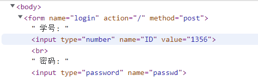

# ExtraHW
 JiWang ExtraHW


#### TODO_服务端
1. 将ssl的证书文件整合到本目录下

# 部署方式
如果没有`python`和`pip`命令, 可以试一试有没有`python3`, `pip3`
```shell
pip install Flask
pip install Flask-SocketIO
pip install Flask-SQLAlchemy
pip install pyOpenSSL
python init.py 
```
安装完python的库就可以直接运行`init.py`了

需要先自己生成https的签名, 用http协议webrtc好像不好使

ssl生成的两个文件位置和文件名需要固定~~(因为路径写死了)~~, 否则需要在init.py文件中改`ssl_certificate`和`ssl_certificate_key`的值

生成的.crt文件必须是`/etc/pki/tls/certs/cert.crt`

生成的.key文件必须是`/etc/pki/tls/private/cert.key`

写的html文件需要放在templates文件夹下, 可以有子文件夹, 支持由服务端在打开一个html的时候提供一些信息, 如下
```html
学号: <input type="number" name="ID" value="{{user_id}}"> <br>
```
`{{变量名}}`这种格式的变量会在flask显示html的时候填充提供的信息, 服务端使用的python函数为``render_template("index.html", user_id=user_id)

上面一行在显示的时候会将value的 `{{user_id}}`替换为python传入的`user_id`变量的值, 可以是空, 具体样式为




